# A worldwide geographical scheme for recording the distribution of marine biota: Revised draft (December 2024) of the proposal.

The proposal for a marine scheme features five Level 1 units, 26 Level-2 units and 536 Level 4 units (compare to 9 Level 1, 52 Level 2 and 609 Level 4 in the current terrestrial scheme). This draft proposal is here posted with the purpose of gathering feedback. It is summarized on the following maps, organized according to the Level 1 and Level 2 units in which they are comprised, followed by notes explaining some of the options taken. All units from Level 4 to Level 1 are detailed in the Excel file Geoschemes_marine_proposal_12_2024.xls placed in this folder.

## Higher level units 

### Level 1 units

Level 1 units are the five oceans. Marginal seas (which are treated in the IHO scheme with the same rank as the major oceans) are appended to the major oceans following the [boundaries set by NOAA](https://www.ncei.noaa.gov/sites/g/files/anmtlf171/files/2023-01/World%20Ocean%20Volumes.pdf)  (Eakins & Sharman, 2010, see also background document) although other sources (e.g. Wikipedia) show slightly different groupings. Limits of proposed Level 1 units are then adjusted to the nearest Level 4 unit, therefore departing from IHO boundaries (see Figure 1 for the detail of these adjustments). Taking into account that the terrestrial Level 1 units used up single-digit codes 1 thru 9, the code for marine Level 1 units is here proposed as single-letter. 

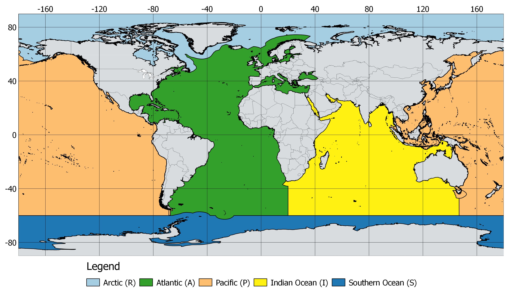

*Figure 1. The proposed level 1 units approximating the five major oceans, adjusted to the nearest Level 4 unit*

### Level 2 units

Level 2 units in the coastal area correspond broadly to the realms of Spalding et al. (2007) Marine Ecoregions of the World, defined therein as “very large regions (...) across which biotas are internally coherent at higher taxonomic levels, as a result of a shared and unique evolutionary history”. Their seaward limit is here adjusted to 200 NM from the natural baseline, and also adjusted to the nearest Level 4 unit. Those realms which, in the MEOW system, straddle the limits of Level 1 oceans (the case of Temperate South America, Temperate Southern Africa, Temperate Australasia, and Subantarctic Islands), are subdivided accordingly. Eastern and Western parts of Temperate Northern Atlantic and Tropical Atlantic are also distinguished at Level 2. High Seas constitute an additional Level 2 unit in each Level 1 ocean. Codes for Level 2 regions will use a two-character format (the Ocean’s letter and one digit).

*Figure 2. The proposed level 2 units approximating the Realms of Spalding et al. (2007). The coastal units are adjusted to the nearest Level 4 unit and to a 200 NM seaward boundary* 

### Level 3 units

Level 3 units are identical to Level 4 when there is no obvious grouping. Examples of obvious groupings are the lesser Antilles or the intersection with MEOW realms among Australian IMCRA regions. In large countries with several Level 4 units, some may be grouped at Level 3 but this is not a rule (e.g. Russia, where Level 4 units in the Far East, the Arctic, the Baltic Sea and the Black sea correspond to four different Level 3 units). Level 3 units are identical to Level 4 in 125 cases, and the other 323 Level 3 units account for the remaining 410 Level 4 units. .

## Level 4: Basic recording units

Level 4 units never encompass the jurisdictional waters of more than one country or territory. For those countries with large and/or complex jurisdictional waters, these are systematically split into as many units as there are Level 1 or Level 2 units involved (e.g. Costa Rica, Guatemala, albeit small, have one Pacific and one Caribbean unit; South Africa has one Atlantic and two Indian Ocean units). 

In addition to this, some large EEZs (e.g. Brazil, Indonesia) are subdivided even if they are entirely contained in the same Level 2 unit; by default, the partition is done along the limits of ecoregions in the MEOW system of Spalding et al. (2007). Exceptions are places where there is a well-established local system of geounits with associated shapefiles. This is the case for Europe, the subregions defined for the Marine Strategy Framework Directive (MSFD; Jensen et al. 2017); for Australia, the IMCRA regions (Commonwealth of Australia. 2006). Further exceptions are places where the MEOW ecoregions have been declared inadequate in published reports (e.g. Madagascar, Cooke et al. 2022).

Of the Level 4 basic recording units, 175 are coincident with the (potential) EEZ of a country or a dependent territory, 132 correspond to subdivisions of an EEZ following MEOW boundaries, 51 to subdivisions of an EEZ following IHO sea areas (i.e. the Marine Region placetype at VLIZ), 39 to Australian IMCRA areas, 18 to subdivisions according to European MSFD subareas, and the 100 subdivisions of high seas are made according to the GOODS scheme.

### Arctic Ocean coastal units

This Level 1 area comprises only one Level 2 coastal unit
 
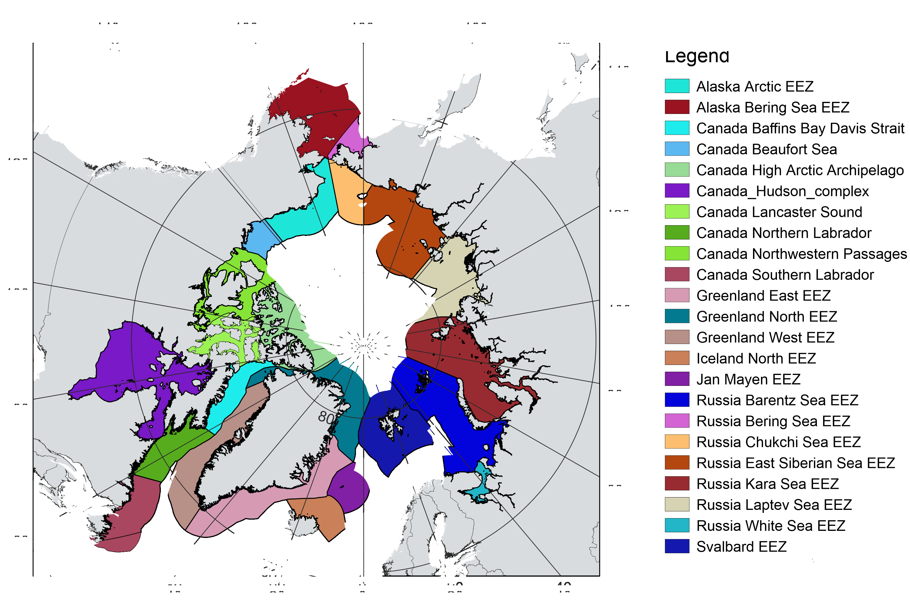

*Figure 3. The proposed Level 4 units for the coastal Arctic realm*

> Notes
>
> Canada has defined (Department of Fisheries and Oceans, 2009) twelve marine bioregions, four of which (Strait of Georgia, Southern Shelf, Northern Shelf and Offshore Pacific) correspond to the small Pacific facade. For the Arctic and North Atlantic, the units are similar to, but not coincident, with the MEOW (Figure 4). For the sake of consistency with the rest of the proposal, the boundaries of the MEOW ecoregions are used to subdivide the Arctic Canadian EEZ. In the case of Russia, the MEOW ecoregions correspond to the marginal seas of the Arctic (Barentz, White Sea, Kara, Laptev, East Siberian Sea, Chuckchi Sea) largely used by Russian authors. 
>
> 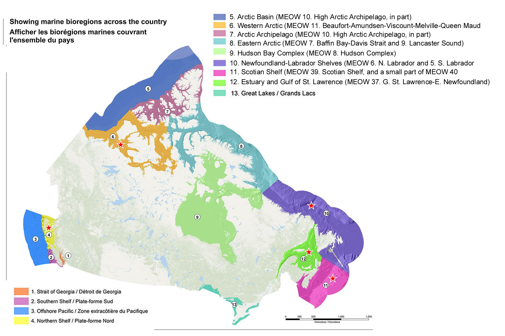
>
>*Figure 4. The Canadian “Marine bioregions”, for comparison with the MEOW-based Level 4 units depicted in Figure 3 (reproduced from Department of Fisheries and Oceans, 2009, legend modified to mention associated MEOW)* 

### Atlantic Ocean coastal units

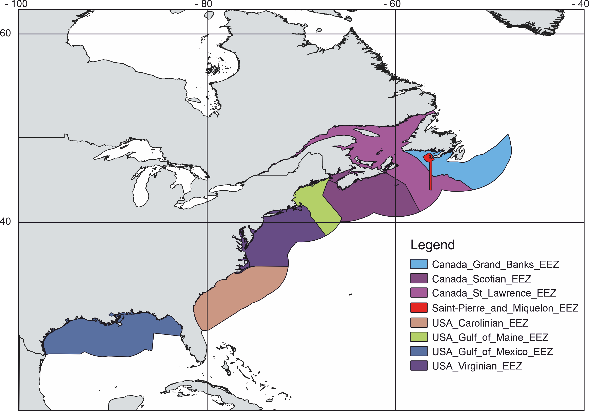

*Figure 5. The proposed Level 4 units for the coastal Atlantic NW temperate realm*

> Notes
> 
> For United States, the terrestrial scheme uses 49 states, not relevant for the marine scheme because some states (e.g.  Florida, California) span important biogeographic boundaries. The molluscan database [Malacolog](http://www.malacolog.org) (Rosenberg, 2009) uses a per-state scheme but there does not seem to exist an established subdivision of the United States EEZ into parts corresponding to each state. Here the proposed option for Canada and United States is to subdivide the large Arctic, Atlantic and Pacific facades according to the MEOW ecoregion boundaries. 

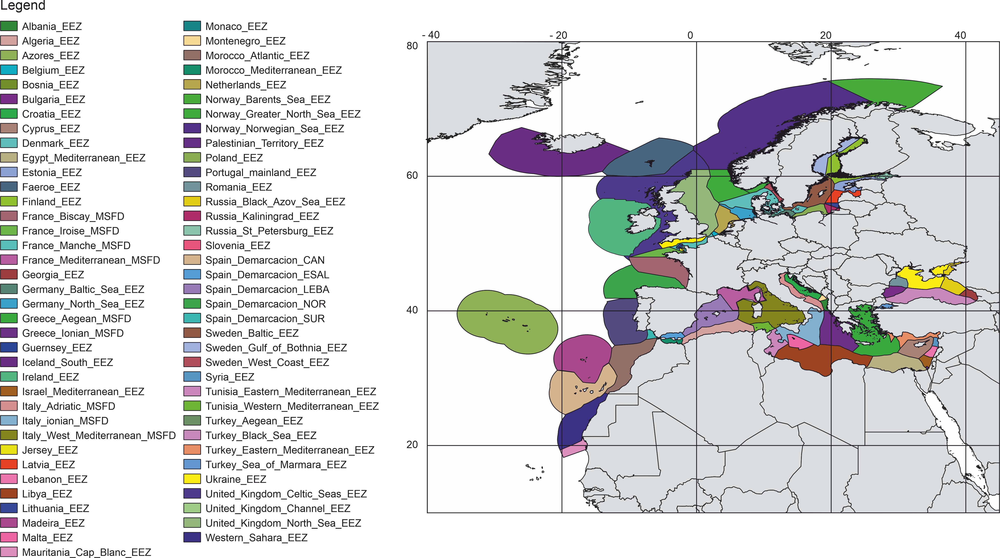

*Figure 6. The proposed Level 4 units for the coastal Atlantic NW temperate realm*

> Notes:
>
> Europe comprises many countries with a large and/or complex maritime facade which requires splitting. The administrative boundaries used in the context of the E.U. Marine Strategies Framework Directive (Jensen, Panagiotidis & Reker, 2017) overcome this problem and are highly suitable as “Basic Recording Units”. For Spain, these polygons have been used for the establishment of an official reference list of all marine organisms present in the country, issued in 2017 (but unfortunately withdrawn in 2020). Therefore, it may be taken as a rule that EEZs of European countries which span more than one of the 10 MSFD regions (Figure 7) are split accordingly. This applies to France, Spain, Italy, Greece, Germany, Sweden and Norway, and can be extended to the United Kingdom even if not longer part of the EU. Given the geographic extension and relative homogeneity, EEZs are directly appropriate for Denmark and Albania even if they straddle two regions.
>
>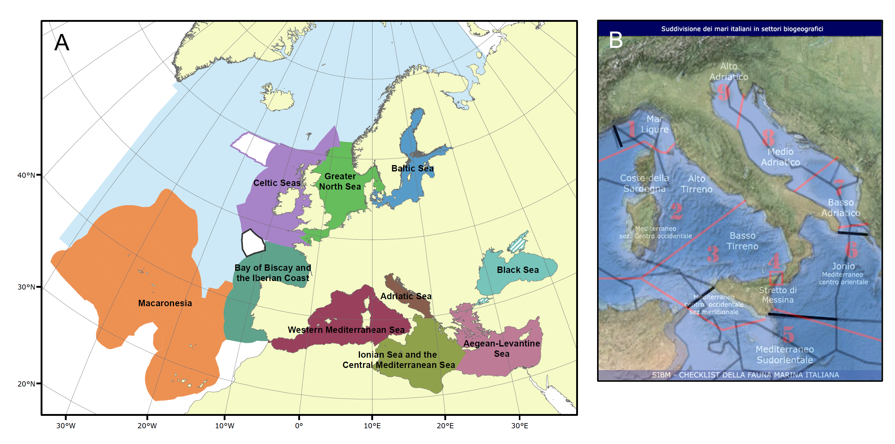
>
>*Figure 7. A: Map of European MSFD regions and subregions. The combination of country + subregion is proposed as spatial assessment scale (reproduced from Jensen et al. 2017). B: The nine “Settori Biogeografici”of Fauna d’Italia (red, adapted from <https://www.colapisci.it/mari/SETTORIBIOGEOGRAFICI/settorigeobiografici.htm> versus the limits of EEZs and IHO water bodies of Marine Regions (black)*
>
> Italy has a specific regionalization designed for recording species in Fauna d’Italia (Relini, 2008). However there are several issues (1) Sector 2 does not distinguish between Sardinia (W Med and Tyrrhenian) and the central Tyrrhenian mainland, whereas both distributions and literature sources are somewhat distinct, (2) Sector 3 straddles Western Mediterranean and Central Mediterranean coasts of Sicily which are in different MSFD subregions and (3) nine sectors are too much at a worldwide scale. For these reasons, and for homogeneity with the other larger countries of the southern EU, the intersections of the 3 MSFD subregions with the Italian potential EEZ are retained. 
>
> There are several important overlapping claims (Portugal/Spain over the Selvagens, France/Spain over Bay of Biscay and Golfe du Lion, Greece/Turkey over Kastelorizo and the Eastern Aegean Sea) which could be either left as overlaps or the overlapping parts treated as separate units. A decision is also to be made on occupied territories (N Cyprus, Crimea, Gaza): should we treat them as separate of use the “legitimate” EEZs?
 
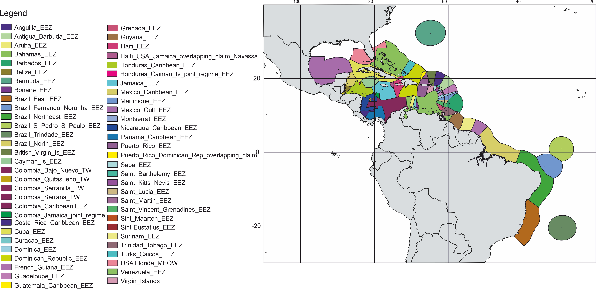

*Figure 8. The proposed Level 4 units for the coastal Atlantic Western tropical realm*

> Notes
>
> The proposal for the tropical Western Atlantic is quite straightforward because most countries are small and their EEZs needs no subdivision. There is a possible issue regarding whether several small islets belonging to Colombia should be lumped with the main EEZ or considered separately (some of them under joint regime must anyway be considered separately). The large Brazilian EEZ is subdivided according to the MEOW boundaries (six in the tropical realm, two in temperate).

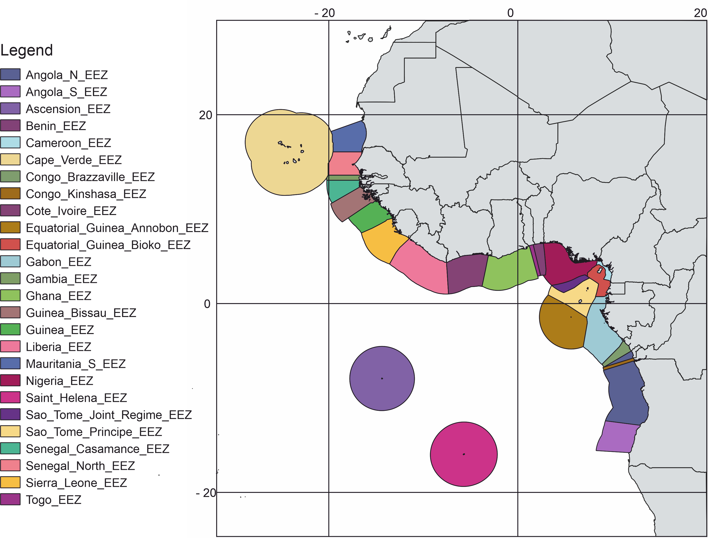

*Figure 9. The proposed Level 4 units for the coastal Atlantic Western tropical realm*

> Notes
>
> For West Africa, the proposal uses directly the subdivisions of Caballero-Herrera et al. (2022) for the regionalization of coastal West Africa. Most countries are represented as their EEZ, but for Mauritania, the temperate area around Cap Blanc is segregated; and for Senegal, the disjunct northern and southern (Casamance) parts. The Angolan EEZ is subdivided to reflect the large amount of biota endemic to the southern part. A small part of the southernmost Angolan EEZ is also segregated to be consistent with the limits of temperate southern Africa MEOW Realm, supported by the data of Caballero-Herrera et al. (2022). Alternately, this could be ignored and the latter realm limited to Namaqua and Namibian EEZ. 

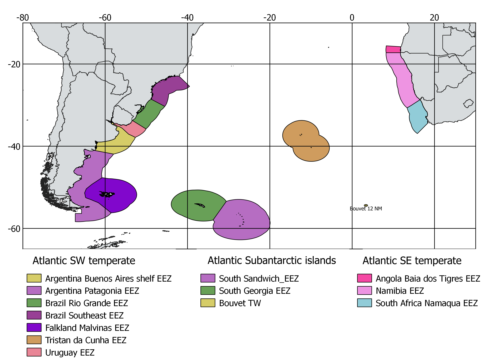

*Figure 10. The proposed Level 4 units for the coastal Atlantic SW temperate realm, the Atlantic subantarctic islands and Atlantic SE temperate realm*

### Indian Ocean Level 4 coastal units

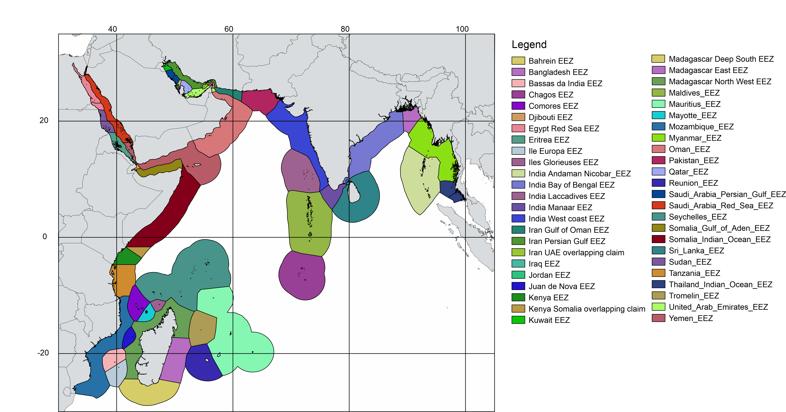

*Figure 11. The proposed Level 4 units for the coastal Indian Ocean Western IP tropical realm*

> Notes 
>
> The sea surrounding Madagascar is large and diverse so as to command subdivisions. Nevertheless the MEOW subdivision is inadequate because it does not single out the “Deep South” which harbours very distinctive biota (Philippe Bouchet pers. comm. 2023). Therefore, the proposed Level 4 units follow Cooke et al. (2023)
 
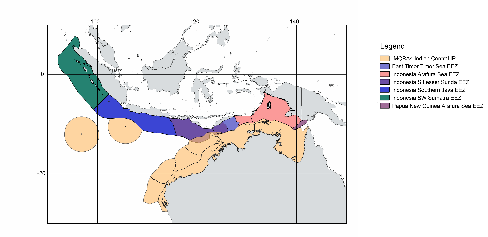

*Figure 12. The proposed Level 4 units for the Indian Ocean part of the coastal Central IP tropical realm*
 
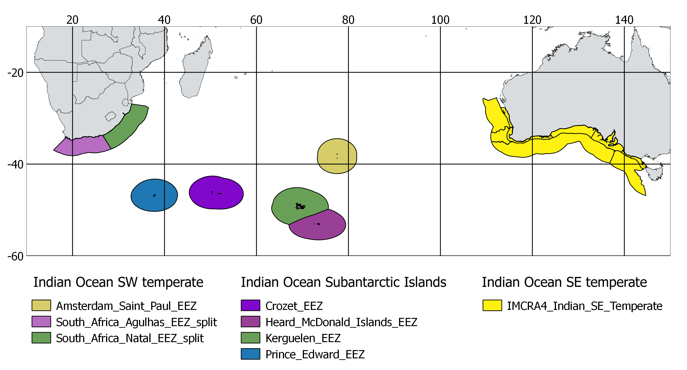

*Figure 13. The proposed Level 4 units for the coastal Indian Ocean SW temperate realm, SE temperate realm and Indian Ocean subantarctic islands*

> Notes
>
> For Australia, there are only seven Level 4 units (the states) in the terrestrial TDWG scheme but the marine realm is complex. No less than 18 MEOW are defined in Australian waters (Spalding et al., 2007, see background document). An alternative scheme is provided with the “Integrated Marine and Coastal Regionalisation of Australia” [IMCRA 4.0 with 36 Provincial Bioregions](https://www.environment.gov.au/system/files/resources/2660e2d2-7623-459d-bcab-1110265d2c86/files/map1-pb.pdf) (Commonwealth of Australia, 2006) which departs from an EEZ-based scheme by considering separately the shallow coastal regions and the remainder of the EEZ. However, it has the advantage of being a coherent system whose outer boundaries are exactly coincident with Australian EEZ. The designation of six marine regions (Figure 15 A; North, Coral Sea, Temperate East, South-east, South-west and North-west) in support of the [Environment Protection and Biodiversity Conservation Act, 1999](https://soe.environment.gov.au/theme/marine-environment/topic/2016/marine-regions) was supposedly informed by the provincial bioregions identified as part of an earlier version of the IMCRA, but the boundaries are not exactly coincident. This scheme departs from traditional Australian marine biogeographical regions (Figure 15 B) and even from the classification into “temperate” and “tropical” suggested in the IMCRA scheme (Figure 14).  
>
> IMCRA regions are used for display in the [Australian Faunal Directory](https://biodiversity.org.au/afd/home), whereas [Atlas of Living Australia](https://www.ala.org.au/) uses only point data for the display on species factsheets but uses the IMCRA regions as bounding box for [search within an area ](http://regions.ala.org.au/#rt=States+and+territories). A further reason for adopting the IMCRA regions as Level 4 units is that, despite their number, their extension is similar to that of Level 4 units elsewhere e.g. Europe whereas the Australian EEZ  is one of the largest in the world 
>
> Groupings can be made at Level 3. The most important is to respect the contrast between temperate and tropical parts (Poore & O’Hara 2007; Ahyong, 2017; Gary Poore, pers. comm. 2021) which, intersected with Level 1 oceans, would define four subdivisions. The suggested groups at Level 3 largely follow the IMCRA 4 scheme proper (tropical, temperate and cold) with Indian and Pacific parts separated, and remote islands (Cocos-Keeling, Christmas, Macquairie, Lord Howe, Norfolk) treated as separate units. 
>
> 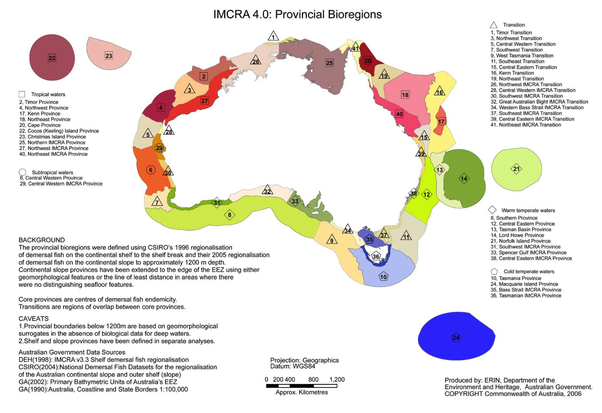
>
>*Figure 14. The IMCRA4 provincial bioregions (source: https://www.environment.gov.au)*
>
>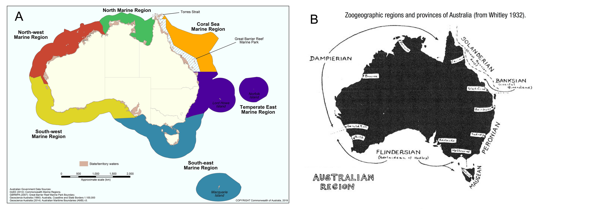
>
>*Figure 15. A: the “Marine Regions” defined in relation with the Australian Environment Protection and Biodiversity Conservation Act, 1999. B: the “classical” bioregions around Australia, reproduced from Poore & O’Hara 2007*

### Pacific Ocean Level 4 coastal units

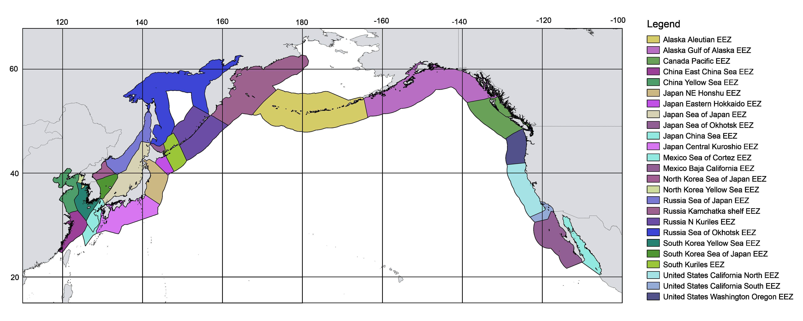

*Figure 16. The proposed Level 4 units for the coastal North Pacific temperate realm*

> Notes
>
> The essential points not to be missed regarding Japan are that (1) the Japan Sea has a perturbed recent geological history (Amano, 2004) and must be considered separately from the East coast and (2) the cold current sweeping the NE coast marks an important boundary at Chōshi (central Honshū, Figure 17A). Then, the remote southern islands (Ogasawara or Bonin Islands) must be considered separately, they hold a tropical fauna which belong to the Central Indo-Pacific MEOW realm and may not occur in the rest of Japanese seas. Several of the MEOW (Figure 17B) are shared with Russia or Korea and must be trimmed to Japanese waters but are otherwise fine to describe the area. MEOW 122 lumps the remote Minami-Tori-Shima (Marcus Is.) with the other Ogasawara islands, and apparently Japanese authors also do so, but they are so remote and physically separated that they are better distinguished; the EEZ surrounding Okino-Tori-Shima is not included in the MEOW system and should be added, albeit it is disputed whether this uninhabited island can trigger an EEZ.
> 
>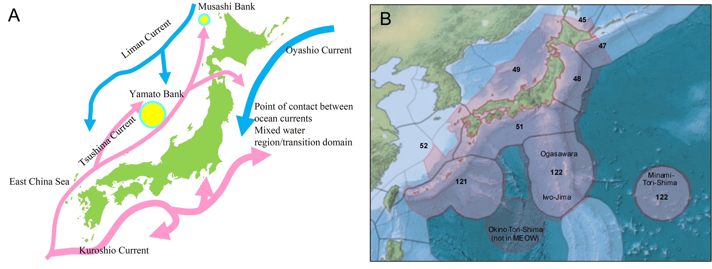
>
>*Figure 17. A: major currents in Japanese seas (source: Fisheries Agency of Japan, 2011). B: MEOWs around Japan, with Japanese EEZ (source: Marine Regions) highlighted. Note the discrepancy between the contour of MEOW shapefiles and the 200 NM line*

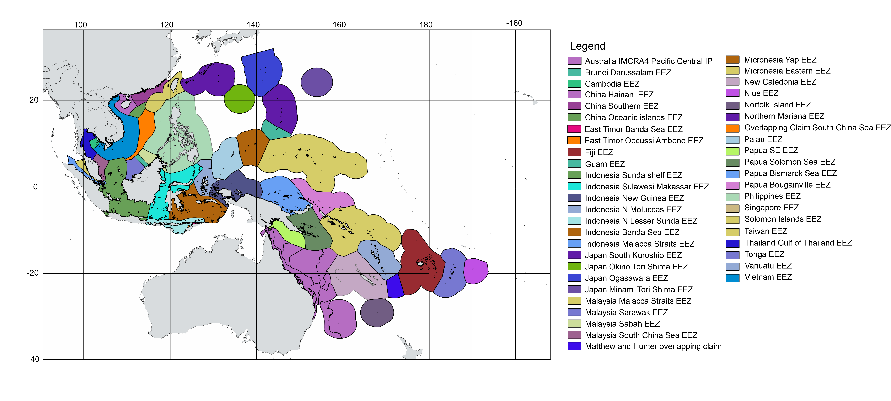

*Figure 18. The proposed Level 4 units for the coastal Pacific Central IP tropical realm*

> Notes
> 
> For Indonesia, the terrestrial scheme has basic recording units corresponding to the main islands or island groups. For the marine part, MEOWs (Figure 19), with adjustments to fit the Indonesian EEZ, seem a reasonable option. Eleven MEOWs account for the Indonesian seas, four of them pertaining mostly to the Indian Ocean, the remaining to marginal seas associated to the Pacific Ocean.  
>
>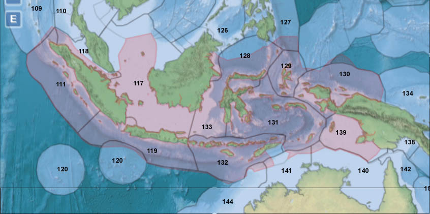
>
>*Figure 19. The MEOW scheme for Indonesian waters, with Indonesian EEZ highlighted* 

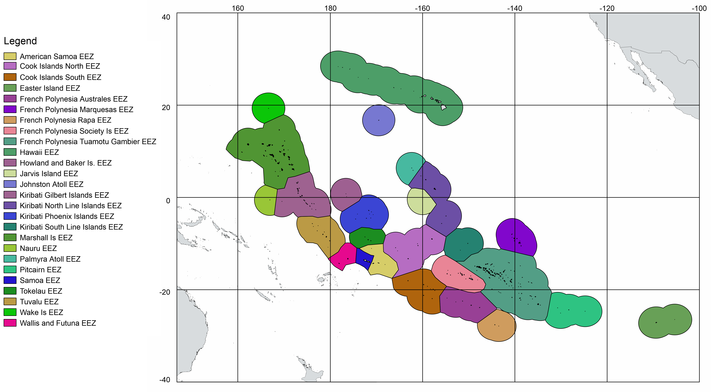

*Figure 20. The proposed Level 4 units for the coastal Pacific Eastern IP tropical realm*

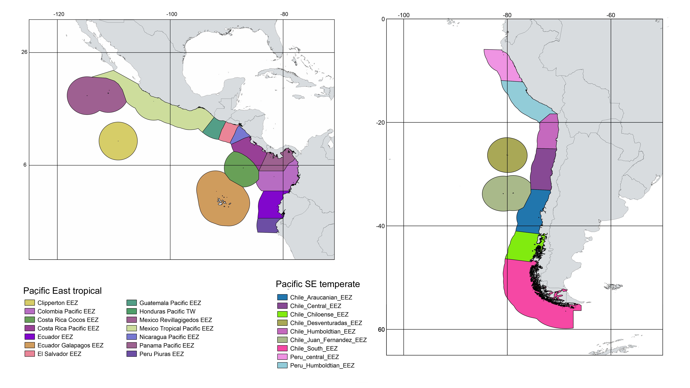

*Figure 21. The proposed Level 4 units for the coastal Eastern Pacific tropical and temperate realms* 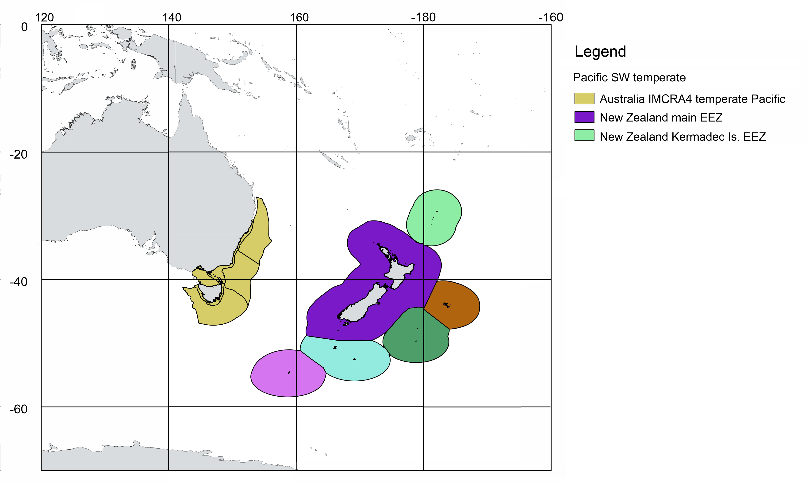

*Figure 22. The proposed Level 4 units for the temperate Western Pacific and Subantarctic Islands* 

### Southern Ocean Level 4 coastal units

In Antarctica, levels of endemism among molluscs, decapods, ascidians, sponges, polychaetes, and shore fishes range from about 42% to 88%, but there seems no support for provincial endemism within the region (Griffiths et al., 2009). As a default solution the MEOW subdivision is used for the 200 NM zone surrounding Antarctiva (which is not an EEZ). 
  
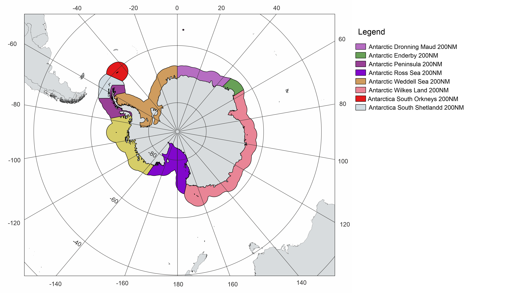

*Figure 23. The proposed Level 4 units for the coastal Southern Ocean*

### Level 4 units for High Seas 
In the proposed scheme, the high seas (beyond the 200 NM limit) of each ocean are treated as Level 2 units, one within each major ocean. For further subdivision in level 4 , we propose to take into account the regionalization of the deep-sea floor (Watling et al., 2013), which combines depth thresholds (300–800 m for upper bathyal, 800–3500 m for lower bathyal, and 3500–6500 m for the abyssal) and mostly abiotic features of the sea water. The paper of Watling et al. is a qualified version of the earlier GOODS proposal (UNESCO, 2009). The hadal zone is defined as depths beyond 6500 m in deep-sea trenches, but those are close enough to the shorelines to be mostly comprised in the national EEZs, and need not be considered here. 

The option taken is to use the 3500 m isobath to distinguish between basins and elevated seafloor features, then to single out discrete, named undersea features (e.g. Mid Atlantic Ridge, Rio Grande Rise, Walwis ridge, Ninetyeast Ridge..., Guyanas Basin, Angola Basin) as Level 4 units. In the Atlantic and Indian Oceans, the subdivision in “provinces” by Watling et al. (2013) is too coarse for the purpose of Level 4 units (four provinces in the Atlantic, only two for the Indian Ocean) and requires further subdivision. In the Atlantic and Indian Oceans, there are well-defined seafloor elevations such as the Mid Atlantic Ridge, Rio Grande Rise and others, of which the names are largely known to the scientific community. The abyssal depth interval below 3500 m covers the bulk (64.5% according to Watling et al. 1993) of the deep sea floor and is conveniently subdivided into discrete basins, the names of which are also widely used in literature on deep sea fauna (e.g. Allen & Sanders, 1996). In the Pacific Ocean, the immense scattering of islets and guyots makes that named features cannot account for most of the deep-sea floor. Conversely, Watling et al. (2013) provide a more detailed subdivision (BY5-BY10 and BY12) which provide a sensible base for the Level 4 units and are here used, with some adjustments. 

In the Southern Ocean, the proposed subdivision largely follows Douglass et al. (2014), with the Pacific Antarctic ridge, Kerguelen Ridge and Weddell shelf outlined by the 3500 m isobath to be consistent with the remaining parts. 

Here, the zone numbers of Watling et al. are appended to the proposed Level 4 High Seas units, but adjustments were made where small parts of a single basin of feature extend to an adjacent zone (cases in Mid Atlantic ridge north of the Azores, where a small part of the mostly AB2 feature extend into AB4, the mostly AB11 East Pacific basin where a small easternmost part belongs to AB9 and a small southern part belongs to AB10; the mostly AB11 part of the NE Pacific basin extends into AB9). 

We acknowledge that the proposed subdivision of Level 4 units is directed to the benthic fauna, and is inadequate to account for the water column, where oceanic water masses should have guided the subdivision. However, this is unavoidable unless the system allows for parallel sets of subdivisions, in which case alternative sets could be based on regionalization of the pelagic realm (e.g. Longhurst, 1998; Sutton et al., 2017). 

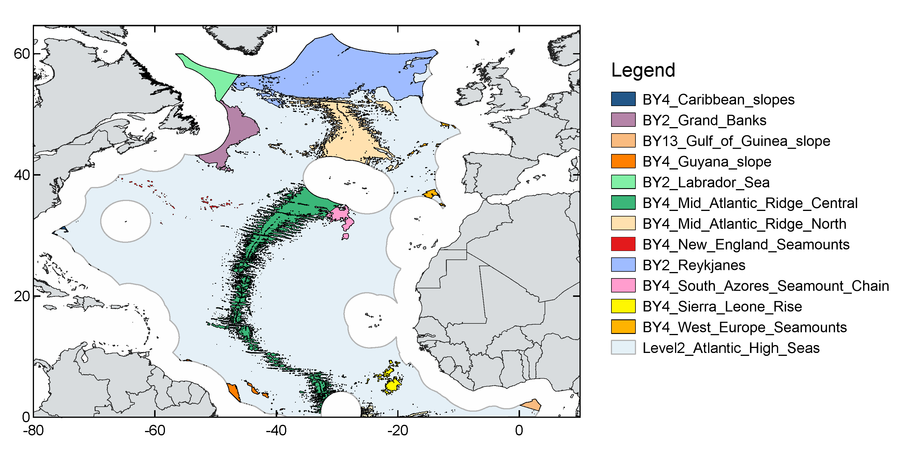

*Figure 24. The proposed Level 4 units for the bathyal level of High Seas in the North Atlantic Ocean*

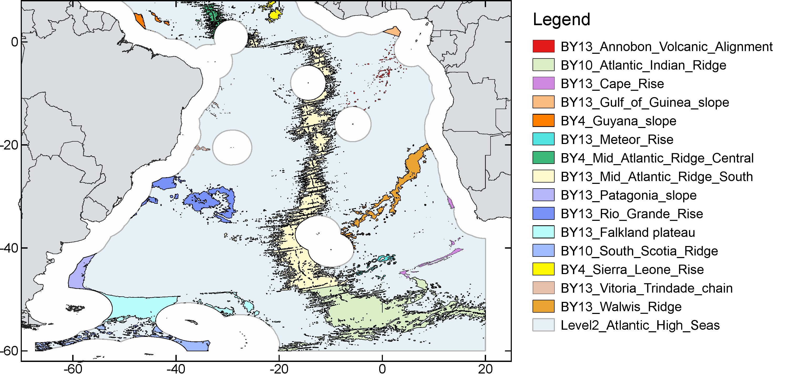

*Figure 25. The proposed Level 4 units for the bathyal level of High Seas in the South Atlantic Ocean. The remaining parts (corresponding to abyssal) of the High Seas are shown in light blue.*

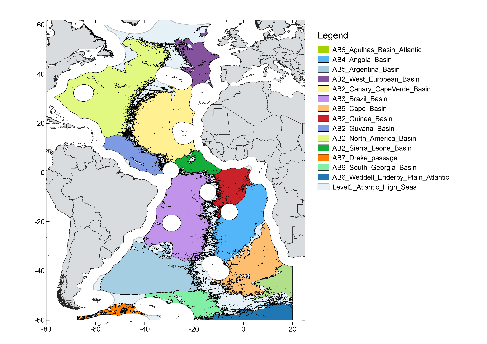

*Figure 26. The proposed Level 4 units for the abyssal level of High Seas in the Atlantic Ocean*

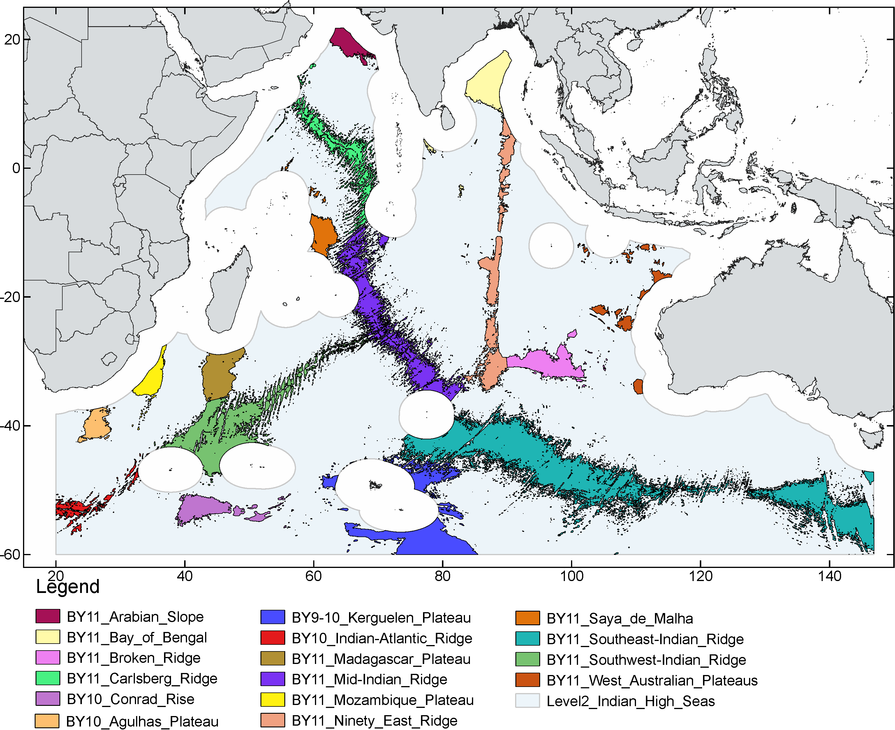

*Figure 27. The proposed Level 4 units for the bathyal level of High Seas in the Indian Ocean. The remaining parts (corresponding to abyssal) of the High Seas are shown in light blue.*

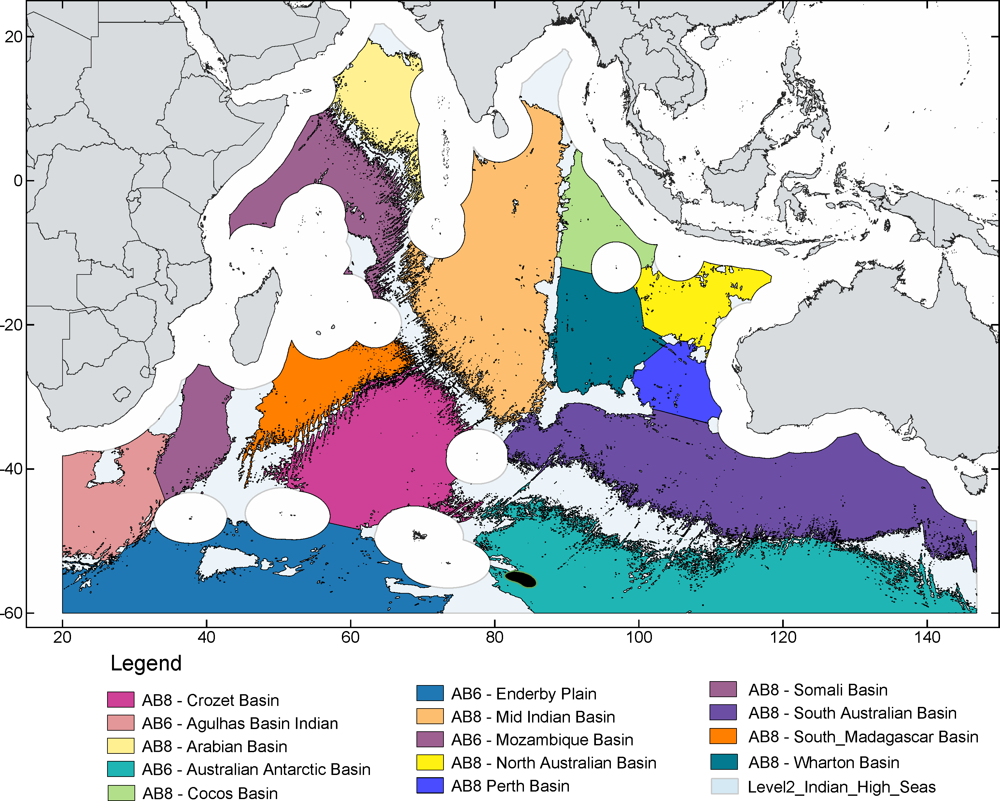

*Figure 28. The proposed Level 4 units for the abyssal level of High Seas in the Indian Ocean.*

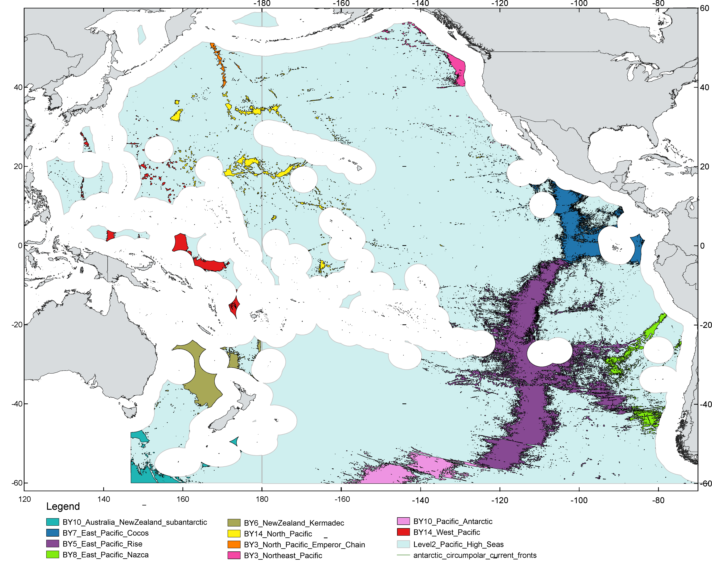

*Figure 29. The proposed Level 4 units for the bathyal level of High Seas in the Pacific Ocean. The remaining parts (corresponding to abyssal) of the High Seas are shown in light blue.*

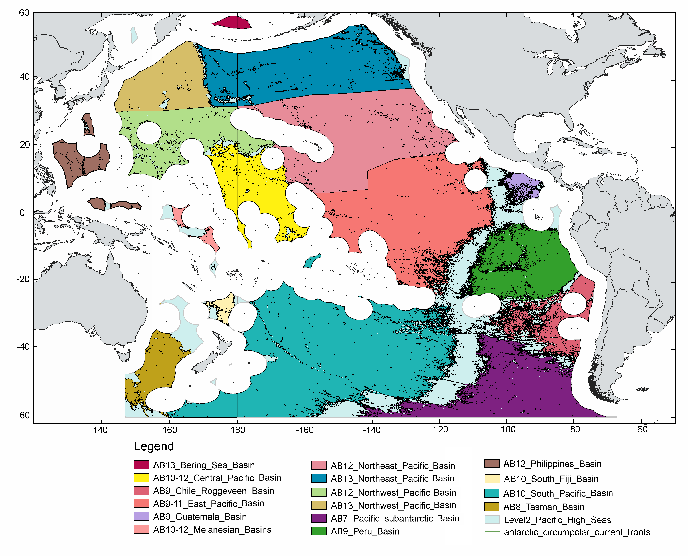

*Figure 30. The proposed Level 4 units for the abyssal level of High Seas in the Pacific Ocean.*

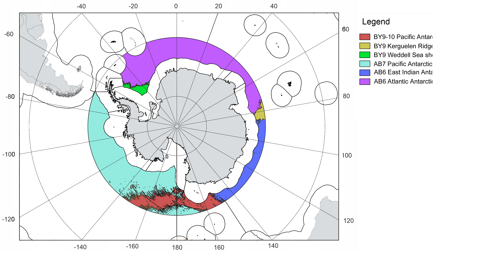

*Figure 31. The proposed Level 4 units for the High Seas in the Southern Ocean* 

## Additional notes

### Adjustment of limits of Level 1 units departing from the IHO scheme

Arctic/Atlantic: Sea areas corresponding to coastal MEOWs 3 (East Greenland Shelf), 4 (West Greenland Shelf), 5 (Northern Grand Banks–Southern Labrador) and 6 (Northern Labrador) to be included in Arctic Level 1 unit, to be consistent with Level 2 “Arctic” MEOW realm which includes those ecoregions. Norwegian EEZ, United Kingdom EEZ and Faeroe Islands EEZ left out, to be consistent with Level 2 “Temperate North Atlantic” MEOW realm 

Arctic/Pacific: Russia - Bering Sea and Alaska – Bering Sea to be included, to be consistent with Level 2 “Arctic” MEOW realm.

Atlantic/Pacific: Chilean part of the South Atlantic Ocean included with Level 1 Pacific, to avoid a small Atlantic subdivision of Chilean EEZ.

Atlantic/Southern Ocean: Overlapping claim South Georgia and South Sandwich Islands: UK / Argentina  included in Southern Ocean Level  unit.

Atlantic/Indian Ocean: South Africa – Agulhas EEZ  corresponding to MEOW 192. Agulhas Bank (MRGid 21806) included with Indian Ocean Level 1 unit.

Pacific/Indian Ocean: Australian IMCRA provinces “Northern Shelf Province” left out of Pacific Level 1 unit, and “Northeast Shelf Transition” included. “Tasmania Province” and “Tasmanian Shelf Province” and “Bass Strait” IMCRA provinces included with Pacific Level 1 unit. Thailand West coast EEZ included in Indian Ocean Level 1 unit. 

### Genealogy of shapefiles 

Shapefiles used to visualize proposed Level 4 units were derived from the Flanders Marine Institute (2019). Maritime Boundaries Geodatabase: [Maritime Boundaries and Exclusive Economic Zones (200NM), version 12]<https://doi.org/10.14284/632>, or by splitting of these according to the above-mentioned guidelines. 
There is an issue with the coastlines being not exactly coincident with the outline of terrestrial regions on the WGSRPD, nevertheless the associated shapefiles (and derived kml files) as stored in the Marine Regions website are perceived as the best external reference for definition of the recording units even if a definition in words (e.g. “Guinea – EEZ”; “Brazil – intersection of EEZ with MEOW 72. Amazonia, adjusted to 200 NM limit”) is also provided. The regional datum used by MSFD shapefiles (ETRS89) and IMCRA (GDA94) differs from that used in Maritime Boundaries v. 12 (the worldwide WGS84), but this results in mismatches in the order of respectively 0.4 m and 2 m, which are ignored.  

When the limits of MEOW are used for the subdivision of large EEZs, the original [MEOW shapefiles from TNC](https://www.arcgis.com/sharing/rest/content/items/903c3ae05b264c00a3b5e58a4561b7e6/data) were not used. There are several issues: (1) their inner limit is placed way inland, and must be trimmed against a shapefile of the baseline (2) the outer limit is not 200 nm but an approximate contour and (3) terms of use include the commitment that “... you are using the data for non-commercial purposes, and *you don't alter them in any way*.” (our italics) whereas we adjust them to EEZs. Therefore, we will subdivide EEZs (from Marine Boundaries v. 12) along the MEOW limits, but will not use the MEOW shapefiles as such. 

For Europe (MSFD subregions) and Australia (IMCRA regions), original shapefiles are available from those respective sources.

Shapefiles used to visualize proposed High Seas units beyond Level 2 units were derived from the bathyal and abyssal provinces of Watling et al. (2013), available on the MarineRegions website (with datum WGS84; placetypes “Abyssal provinces” AB1 to AB13 (AB14 ignored because entirely comprised in EEZs) and “Lower Bathyal provinces” BY1 to BY12). Processing for obtaining shapefiles to visualize the proposed Level 4 recording units involved the following steps: 
(1) Intersect Abyssal provinces with the Level 2 “High Seas” unit of each ocean in order to exclude areas comprised in EEZs
(2) Erase Abyssal provinces from the Level 2 “High Seas” unit of each ocean, in order to obtain shapefiles representing areas less than 3500 m depth, not only the 800-3500 interval.
(3) When needed due to very complex topography, simplify those trimmed shapefiles using the “point remove” algorithm in ArcGis (minimum area 10000 m2, tolerance 100 metres). 
Following these first steps, two sets of intermediate shapefiles spanning only high seas (one “Bathyal” down to 3500 m and one “Abyssal” below that depth) were obtained for each Level 1 unit. 

Further subdivision involved the following steps:
(4) Create a set of template shapefiles delimiting the major basins in the Abyssal 
(5) Intersect those templates with the simplified “Abyssal” shapefile to obtain the Level 4 units corresponding to abyssal basins
(6) create a set of template shapefiles delineating the major features (segments of mid-oceanic ridges and other named seafloor elevations). 
(7) Intersect those templates with the simplified “Lower bathyal” shapefile to obtain the Level 4 units corresponding to seafloor elevation features.

### Syntax for geounits names and labels

Following section 3.3.3.1. of [TDWG Standards Documentation Specification](https://github.com/tdwg/vocab/blob/master/sds/documentation-specification.md), the term name is a controlled value that represents the class, property, or concept [here, concept] described by the term definition. In the case of WGSRPD and the Geoschemes proposed standards, those local names correspond to the codes designating the units (one digit or letter for Level 1, two for level 2, three for level three, and level 4 names derived from Level 3 names with two more letters appended).

Taking into account that the marine proposal goes in the footsteps of WGSRPD, it is essential to maintain codes with the same format. In the WGSRPD, Level 1 units are identified by a one-digit number (1 to 9), Level 2 regions by a two-digit number (10 to 91), Level 3 units by a three-letter code (not related to the two-letter ISO-code of the country), and Level 4 units by a five-letter code in the format XXX-YY where XXX is the Level 3 code and YY an identifier of the level 4 unit. Where Level 3 and Level 4 are identical (the case of 294 out of 614 Level 4 units in WGSRPD i.e. nearly half), this is denoted by a Level 4 code in the format XXX-OO (the double letter ‘O’). In WGSRPD, Level 4 parts of large countries (e.g. Russia), or not so large but situated at crossroads (e.g. Egypt) may belong to different Level 3, Level 2 and Level 1 units, and this also happens in the marine system (e.g. Egypt, Costa Rica). The proposed codes have now (July 2024) been added to the Ecxel files in which the Level 4 units are detailed.

Developing a set of similar codes for the marine part poses some challenges in order to avoid homonymy with terrestrial codes. Taking into account that the system is alphanumerical and that numbers in the Level 1 and Level 2 are already used up by the terrestrial units, we are compelled to use letters for marine Level 1 units (we propose R for Arctic, A for Atlantic, I for Indian, P for Pacific, and S for Southern Ocean), then one digit appended to those letters (A1, A2, etc..) for the marine Level 2 units. At Level 3, codes must all be distinct from the WGSRPD codes because the Level 2 and Level 1 units above in the hierarchy are different. We propose that the Level 3 code be composed of two letters (by default, the ISO-2 code of the country if appropriate) and one digit, the presence of that digit unambiguously denoting a marine code (there are three letters in all terrestrial WGSRPD codes). The digit is ‘1’ by default, but must differ if more than one unit is defined for the country or if the letters are already used in another Level 3 unit. At Level 4, the convention of using the suffix ‘-OO’ when Level 4 is identical to Level 3 is conserved, otherwise diagnostic letters are used. 

For High Seas, it would have been tempting to use the Watling et al. (2013) provinces as codes for Level 3, but unfortunately this is not practicable because there are 14 provinces in the bathyal and 14 more in the abyssal, forcing some codes into four characters instead of three. Renaming them as B01 to B14 and A01 to A14 would help, but still this would not account for the fact that some Watling provinces straddle more than one oceaan (Level 1 unit), therefore must be subdivided. Taking into account these constraints, we propose Level 3 codes for the deep sea using the two characters of the Level 2 in which they are comprised, and the third character a letter to discriminate their belonging in different provinces of Watling et al. (1993). 

Admittedly, those codes, be they WGSRPD or Geoschemes marine, are not user-friendly, but they are needed as part of the proposed standard. With respect to the human user, we have focused on the full names, which are treated as “labels”, with the intention to make them as easy as possible to identify with a geographic area Following section 3.3.3.1. of TDWG Standards Documentation Specification, the label is a word or short phrase that serves as a human-readable name for the term. The labels in our proposal should start always with the country name e.g. France - Bay of Biscay, not “French part of the Bay of Biscay”. Some users dislike adjectives, which are sometimes awkward to pick in the pull-down menu. Remote parts and/or dependent states e.g. Martinique are named on their own when they have an ISO code distinct from the ruling country (e.g. Martinique [ISO code: MQ, not FR of mainland France]), not when the ISO code is the same (e.g. Spain – Demarcación marina Canaria [ISO code: ES like mainland Spain])

Decisions are to be made on the treatment of overlapping claims resulting from unsettled borders. Currently these (e.g. France/Spain in Bay of Biscay, Spain/Portugal in the Selvagem islands) are appended to both adjacent geounits which therefore overlap, not treated as separate units (issue to be confirmed – this generates issues with summing up surfaces). Overlapping claims over an entire territory are treated as a separate geounit (e.g. the Falkland Islands). 

Basic recording units are therefore labelled according to this pattern:

Country – EEZ (complete EEZ of the country; maybe we should use instead “Jurisdictional waters” when no EEZ is declared (Mediterranean) or just a factual “200 NM”)

Country – Region EEZ or Country – IHOarea EEZ when a large or complex EEZ has been subdivided according to IHO (i.e. placetype “Marine Region”), MEOW or other scheme. 

Country – MSFD subzone where applicable in Europe (omit “EEZ” in this case, the labels involve sea areas)

Australia – IMCRA provincial bioregion where applicable

The mention of “EEZ” in the proposed label of marine geounits is needed because otherwise, there is confusion with terrestrial geounits of the same country. It may be omitted is the part is explicitly a sea area (e.g. Saudi Arabia – Red Sea)

The labelling of high seas features involves no country name. Taking into account that the regionalization of Watling et al. 2013 has been instrumental in the design of units, we use their sectors (BY1 to BY14 for areas less than 3500 m deep, see above, and AB1 to AB14 for those deeper than 3500 m) as the first component of the label of high seas units, followed by the name of the undersea feature comprised in that unit e.g. “AB4 – Angola Basin”, “BY13 – Rio Grande Rise”.

## References

Ahyong S. (2017). Biogeography of Australian Marine Invertebrates. pp. 81-99 in: Ebach M.C. (Ed.) Handbook of Australasian Biogeography. CRC Press, Boca Raton  <https://doi.org/10.1201/9781315373096>

Allen J.A. & Sanders H.L. (1996). The zoogeography, diversity and origin of the deepsea protobranch bivalves of the Atlantic: the epilogue. Progress in Oceanography 38, 95–153 <https://doi.org/10.1016/S0079-6611(96)00011-0>

Amano K. (2004). Biogeography and the Pleistocene extinction of neogastropods in the Japan Sea. Palaeogeography, Palaeoclimatology, Palaeoecology, 202: 245-252. <https://doi.org/10.1016/S0031-0182(03)00637-0>

Caballero‐Herrera J.A., Olivero J., von Cosel R. & Gofas S. (2022). An analytically derived delineation of the West African Coastal Province based on bivalves. Diversity and Distributions, 28(12), 2791-2805. <https://doi.org/10.1111/ddi.13454>

Commonwealth of Australia (2006). A Guide to the Integrated Marine and Coastal Regionalisation of Australia Version 4.0. Canberra, Australia, Department of the Environment and Heritage. <https://www.environment.gov.au/system/files/resources/2660e2d2-7623-459d-bcab-1110265d2c86/files/map1-pb.pdf>

Cooke A., Wells S., Oates J., Bouchet P., Gilchrist H., Leadbeater A., Gough C. L. A., Rasoloniriana R.,
Randrianjafimanana T., Jones T. G., Aigrette L., Ratefinjanahary I. & Ravelonjatovo J. (2023). Marine and coastal biodiversity and conservation,  pp. 311-451, in Goodman S. M. (Ed.) The New Natural History of Madagascar. Princeton University Press. <https://doi.org/10.1515/9780691229409>

Department of Fisheries and Oceans. (2009). Development of a framework and principles for the biogeographic classification of Canadian marine areas. Canadian Science Advisory Secretariat, Science Advisory Report 2009/056, 17 pp. <https://web.archive.org/web/20221005195716/https://waves-vagues.dfo-mpo.gc.ca/library-bibliotheque/338958.pdf>

Douglass L.L., Turner J., Grantham H.S., Kaiser S., Constable A., et al. (2014) A hierarchical classification of benthic biodiversity and assessment of protected areas in the Southern Ocean. PLoS One 9(7): e100551 (16 pp.). <https://doi.org/10.1371/journal.pone.0100551>

Eakins B.W., & Sharman G.F. (2010). Volumes of the World’s Oceans from ETOPO1. NOAA National Geophysical Data Center, Boulder, CO. <https://www.ncei.noaa.gov/sites/g/files/anmtlf171/files/2023-01/World%20Ocean%20Volumes.pdf>

Fisheries Agency of Japan (2011). Fisheries Policy Outline for FY2011. White Paper on Fisheries 2010/2011: summary. <http://www.jfa.maff.go.jp/j/kikaku/wpaper/pdf/2010_haku_en6.pdf>

Griffiths H.J., Barnes, D. K. & Linse K. (2009). Towards a generalized biogeography of the Southern Ocean benthos. Journal of Biogeography, 36(1), 162-177. < https://doi.org/10.1111/j.1365-2699.2008.01979.x>

Jensen H.M., Panagiotidis P. & Reker J. (2017). Delineation of the MSFD Article 4 marine regions and subregions Version 1.0. Technical document of the European Environmental Agency, 21 pp. Available from  <https://web.archive.org/web/20170605025903/https://www.eea.europa.eu/data-and-maps/data/msfd-regions-and-subregions/technical-document/pdf/download>

Longhurst A. (1998) Ecological Geography of the Sea. Academic Press, San Diego, xv + 542 pp., 22 plates.

Poore G.C.B. & O'Hara T.D. (2007). Marine biogeography and biodiversity of Australia. Pp. 177-198 in: Connell, S.D., and Gillanders, B.M. (eds), Marine Ecology. Oxford University Press: South Melbourne <https://doi.org/10.1201/9781315373096>

Relini G. (2008).  Introduzione. pp.  v-xi, in: Relini G: (Ed.) Checklist della flora e della fauna dei mari italiani, parte I. Biologia Marina Mediterranea, 15 (suppl.) <https://www.sibm.it/public/book-files/SIBM-Biologia-Marina-Mediterranea-15-Suppl-1---2008-ITAENG--Num-.pdf>

Rosenberg G. (2009) Malacolog 4.1.1. A database of Western Atlantic Marine Mollusca. <http:// www. malacolog. org/>

Spalding M. D., Fox H. E., Allen G. R., Davidson N., Ferdaña Z. A., Finlayson M. A. X., ... & Robertson J. (2007). Marine ecoregions of the world: a bioregionalization of coastal and shelf areas. BioScience, 57: 573-583. <https://doi.org/10.1641/B570707>

Sutton T. T., Clark M. R., Dunn D. C., Halpin P. N., Rogers A. D., Guinotte J., ... & Heino M. (2017). A global biogeographic classification of the mesopelagic zone. Deep Sea Research Part I: Oceanographic Research Papers, 126, 85-102. < https://doi.org/10.1016/j.dsr.2017.05.006>

UNESCO (2009). Global Open Oceans and Deep Seabed (GOODS) – Biogeographic Classification. Paris, UNESCO-IOC, Technical Series 84, 87 pp.

Watling L., Guinotte J., Clark M. R. & Smith C. R. (2013). A proposed biogeography of the deep ocean floor. Progress in Oceanography, 111, 91-112. < https://doi.org/10.1016/j.pocean.2012.11.003>
